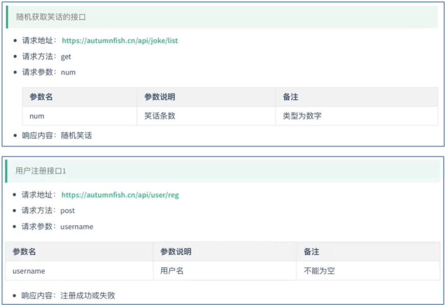

# 1.HTML
```html
<!--label标签的使用
    必选属性for,值为需要绑定的标签的id
-->
<input type="checkbox" id="runoob">
<label for="runoob">Runoob</label>
```

# 2.css

# 3.vue
## vue网络编程部分
 ```html
<!--    引入axios的代码-->
<script src="https://unpkg.com/axios/dist/axios.min.js"></script>
```

####**项目中使用到的链接说明**


